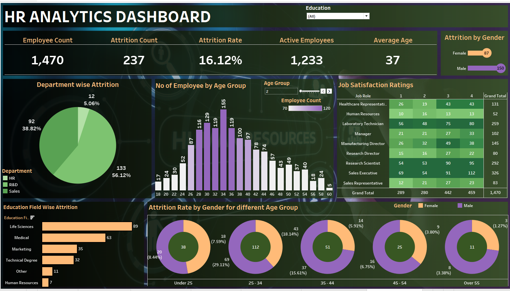

# Employee Attrition Prediction - A Data Science Solution for HR Analytics

Predicting employee turnover before it happens, enabling proactive retention strategies and reducing costly departures.

## Project Overview

Employee attrition costs organizations thousands of dollars per departure in recruiting, training, and lost productivity. This project builds a machine learning system that identifies at-risk employees with 73% accuracy, giving HR teams the lead time needed for effective intervention.

**The Challenge:** Predict which employees are likely to leave based on demographic, job-related, and satisfaction metrics.

**The Solution:** A Logistic Regression model optimized for recall (catching departures) over accuracy (being right overall), deployed as an interactive web application.

**Business Impact:** The model identifies 73% of departing employees, potentially preventing millions in turnover costs through early intervention.

## Key Results

| Metric | Value | Business Meaning |

| Recall | 73% | Catches 3 out of 4 employees who leave |
| Precision | 32% | ~3 false positives per true positive |
| Accuracy | 74% | Overall correctness |
| F1-Score | 0.44 | Balanced performance measure |

## Project Structure

```
employee-attrition-prediction/
│
├── data/
│   ├── raw/                          # Original dataset
│   ├── processed/                    # Clean, feature-selected data (19 features)
│   └── README.md                     # Data documentation and preprocessing journey
│
├── notebooks/
│   ├── eda.ipynb                     # Exploratory analysis and insights
│   ├── models.ipynb                  # Model development and evaluation
│   └── README.md                     # Notebook documentation
│
├── deployment/
│   ├── app.py                        # Streamlit web application
│   ├── model.pkl                     # Trained Logistic Regression model
│   ├── requirements.txt              # Python dependencies
│   └── README.md                     # Deployment instructions
│
├── reports/
│   ├── figures/                      # Visualizations (EDA + model performance)
│   ├── model_performance.md          # Detailed performance analysis
│   └── README.md                     # Reports documentation
│
└── README.md                         # This file
```

## The Data Science Journey

### 1. Data Understanding and Preprocessing
Started with 1,470 employee records containing 35 features mixing demographics, job details, and satisfaction scores.

**Key preprocessing decisions:**
- Removed data leakage features that directly revealed the target
- Applied strategic encoding (label encoding for ordinal, one-hot for nominal)
- Used mutual information for feature selection (47 → 19 features)
- Addressed multicollinearity by removing redundant features

### 2. The Class Imbalance Discovery
Initial models achieved 87% accuracy but only 15% recall - they were predicting "stays" for everyone. This looked impressive on paper but provided zero business value.

**The breakthrough:** Implementing class-balanced weights shifted the model's focus from overall accuracy to actually catching departures, increasing recall from 15% to 73%.

### 3. Model Selection
Tested three algorithms with multiple configurations:
- Logistic Regression (baseline and balanced)
- Random Forest (baseline and balanced)  
- K-Nearest Neighbors (baseline and SMOTE)

**Winner:** Logistic Regression with balanced class weights - best recall while maintaining interpretability for stakeholder trust.

### 4. Deployment
Built a Streamlit web app allowing HR teams to input employee data and receive instant risk assessments with actionable recommendations.

## Technical Highlights

**Feature Engineering:**
- Mutual information analysis for objective feature importance
- Strategic encoding preserving ordinal relationships
- Correlation analysis to eliminate redundancy

**Class Imbalance Handling:**
- Class weight balancing
- SMOTE (Synthetic Minority Over-sampling Technique)
- Threshold optimization for business objectives

**Model Evaluation:**
- Focused on recall as primary metric (business-driven decision)
- ROC-AUC analysis for performance comparison
- Confusion matrices for error pattern analysis

## Key Insights

**Top Predictors of Attrition:**
1. Age (younger employees at higher risk)
2. Job Level (entry/mid-level positions)
3. Job Involvement (engagement matters)
4. Monthly Income (compensation is critical)
5. Overtime (work-life balance impacts retention)

## Dashboard Preview


<p align="center">
  
</p>


**Surprising Non-Predictors:**
Gender, education field, and marital status showed minimal predictive power, suggesting attrition is driven more by job experience and satisfaction than demographics.

## Running the Application

**Quick Start:**
```bash
# Clone the repository
git clone https://github.com/yourusername/employee-attrition-prediction.git
cd employee-attrition-prediction

# Install dependencies
pip install -r deployment/requirements.txt

# Run the app
cd deployment
streamlit run app.py
```

The application launches at `http://localhost:8501` with an intuitive interface for risk prediction.

## Technologies Used

- **Python 3.8+** - Core programming language
- **Pandas & NumPy** - Data manipulation and analysis
- **Scikit-learn** - Machine learning algorithms and preprocessing
- **Imbalanced-learn** - SMOTE implementation
- **Matplotlib & Seaborn** - Data visualization
- **Streamlit** - Web application framework

## Project Learnings

**Technical:**
- Class imbalance requires business-driven metric selection, not just accuracy maximization
- Feature selection should balance statistical importance with interpretability
- Model performance must align with business objectives, not academic benchmarks

**Business:**
- False negatives (missing departures) cost more than false positives (unnecessary conversations)
- Interpretability matters - stakeholders need to trust and understand predictions
- Imperfect predictions are valuable if actionable

## Limitations and Future Work

**Current Limitations:**
- 27% of departing employees go undetected
- Model doesn't account for sudden external factors
- Trained on historical data that may not reflect future patterns

**Potential Improvements:**
- Incorporate real-time engagement metrics (email activity, calendar patterns)
- Add temporal features to capture trends over time
- Implement ensemble methods for improved performance
- Build feedback loop to retrain with actual departure data

## Business Recommendations

**For HR Teams:**
- Run quarterly risk assessments on entire workforce
- Prioritize high-risk employees (>70% probability) for immediate intervention
- Track prediction accuracy to validate and improve the model

**For Leadership:**
- Use aggregate risk scores to identify systemic retention issues
- Monitor trends in attrition predictors (compensation, workload, satisfaction)
- Budget retention resources based on predicted at-risk populations

## Contact and Feedback

This project demonstrates end-to-end data science capability from data preprocessing through model deployment. The approach prioritizes business value over technical complexity, and honest assessment over inflated metrics.

Interested in discussing the methodology, results, or potential improvements? Feel free to reach out or open an issue.

---

**Note:** This is a portfolio project using synthetic/anonymized data for demonstration purposes. Any production deployment would require additional considerations around data privacy, model monitoring, and ethical AI practices.